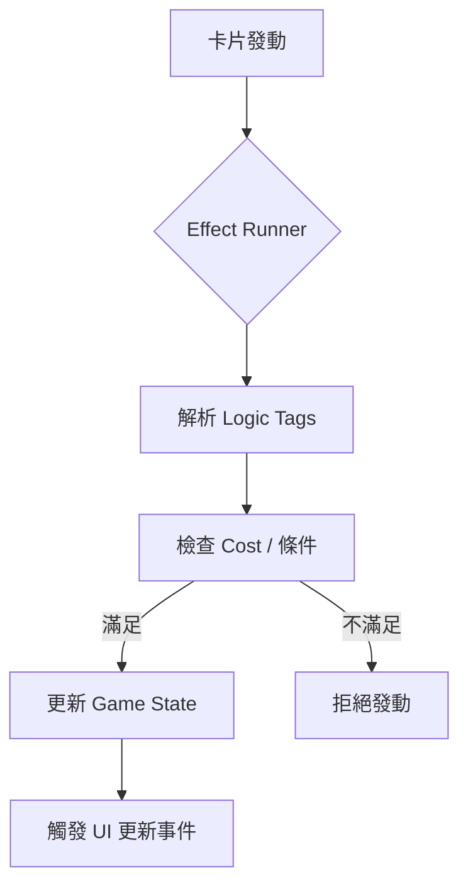

# UA-Connect 發展藍圖 (Roadmap)

本專案旨在打造一個高效能、事件驅動的 Union Arena 連線平台，結合 Electron 的本地資源管理能力與 React 的流暢 UI。

## 發展階段

### Phase 1: 卡片數據與資產攝取 (Data & Asset Ingestion)
- [ ] 實作 Python Playwright 爬蟲，從官方網站抓取卡片資料。
- [ ] 自動化下載卡片影像並存放於 `assets/cards/`。
- [ ] 設計 `cards.json` 結構，初步定義 Effect Logic Tags。
- [ ] 建立資料驗證機制，確保資料完整性。

### Phase 2: 組牌器與本地檔案管理 (Deck Builder & Local File Management)
- [ ] 實作 Electron IPC 通訊頻道，用於讀取本地卡片資產。
- [ ] 開發 React 組牌介面 (Deck Builder UI)。
- [ ] 支援本地牌組存檔 (JSON 格式)。
- [ ] 實現卡片搜尋與篩選功能。

### Phase 3: 核心遊戲引擎 (Core Game Engine)
- [ ] 實作 AP (Action Points) 與 Energy 邏輯系統。
- [ ] 開發 Effect Runner，解析並執行卡片上的 Logic Tags。
- [ ] 建立事件驅動的遊戲狀態機 (Event-driven Game State)。
- [ ] 實作基礎的回合流程 (Phase Management)。

### Phase 4: 對戰盤 UI 與本地沙盒 (Battle Mat UI & Local Sandbox)
- [ ] 實作拖放 (Drag & Drop) 對戰盤介面。
- [ ] 本地雙人沙盒測試模式 (一機雙人模擬)。
- [ ] 動畫效果與視覺反饋 (使用 Framer Motion)。
- [ ] 遊戲日誌 (Game Log) 系統。

---

## 系統架構預想

### Effect Runner 流程

### IPC 通訊結構
- **Renderer -> Main**: `get-card-data`, `load-deck`, `save-deck`
- **Main -> Renderer**: `update-game-state`, `asset-loaded`
